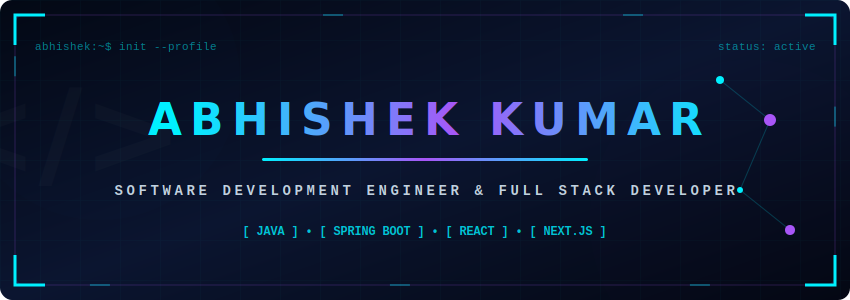

<div align="center">

<!-- Custom Animated SVG Header Banner -->


<br/>


<br/>

[](https://krabhishek.vercel.app/)
[](https://www.linkedin.com/in/abhishek2k24)
[](https://leetcode.com/Abhi_1_2_3)
[](https://auth.geeksforgeeks.org/user/krabhishek0321)
[](mailto:krabhishek2k02@gmail.com)

</div>

---

## 🧑‍💻 About Me

<table border="0" width="100%">
  <tr>
    <td width="50%" valign="top">
```java
public class Abhishek extends Developer {
    String name        = "Abhishek Kumar";
    String role        = "Java Full Stack Developer";
    String experience  = "3+ Years (BFSI & E-Commerce)";
    String location    = "Pune, Maharashtra, India";
    String education   = "B.Tech. CSE — CDGI, Indore";
    boolean openToWork = true;
    String[] currentlyBuilding() {
        return new String[]{ 
            "Java / Spring Boot", 
            "Next.js / TypeScript", 
            "Microservices Architecture" 
        };
    }
    String funFact() {
        return "I cook as well as I code 🍳";
    }
}
```
    </td>
    <td width="50%" valign="top">
      <h3>📋 Profile Overview</h3>
      <ul>
        <li>👤 <b>Name</b>: Abhishek Kumar</li>
        <li>🎯 <b>Role</b>: Java Full Stack Developer (3+ Years Experience)</li>
        <li>📍 <b>Location</b>: Pune, Maharashtra</li>
        <li>📞 <b>Contact</b>: <a href="tel:+918421573950">+91-8421573950</a></li>
        <li>📬 <b>Email</b>: <a href="mailto:krabhishek2k02@gmail.com">krabhishek2k02@gmail.com</a></li>
        <li>🌐 <b>Portfolio</b>: <a href="https://krabhishek.vercel.app/">krabhishek.vercel.app</a></li>
      </ul>
    </td>
  </tr>
</table>
---

## 🛠️ Tech Stack

<table border="0" width="100%">
  <!-- Row 1: Languages & Frontend -->
  <tr>
    <td width="50%" valign="top">
      <h4>☕ Programming Languages</h4>
      
      
      
      
      
      
    </td>
    <td width="50%" valign="top">
      <h4>🌐 Frontend Technologies</h4>
      
      
      
      
      
      
      
      
      
      
      
    </td>
  </tr>
  
  <!-- Row 2: Backend & Databases -->
  <tr>
    <td width="50%" valign="top">
      <h4>⚙️ Backend Frameworks &amp; Architecture</h4>
      
      
      
      
      
      
      
      
    </td>
    <td width="50%" valign="top">
      <h4>🛢️ Databases &amp; Caching</h4>
      
      
      
      
    </td>
  </tr>

  <!-- Row 3: Testing/DevOps & CS Fundamentals -->
  <tr>
    <td width="50%" valign="top">
      <h4>🧪 Testing &amp; API Documentation</h4>
      
      
      
      
      <br/><br/>
      <h4>🛠️ Tools &amp; DevOps Platform</h4>
      
      
      
      
      
      
      
      
    </td>
    <td width="50%" valign="top">
      <h4>📚 Core CS Fundamentals</h4>
      
      
      
      
      
      
    </td>
  </tr>
</table>

---

## 💼 Professional Experience

### **Sofrego Private Limited** | Java Full Stack Developer *(Full-Time)*
*January 2024 – Present | Location: Pune, Maharashtra*
> **Core Tech**: Java, Spring Boot, Spring Security, Hibernate/JPA, MySQL, MongoDB, React.js, Next.js, TypeScript, JUnit, Mockito, Swagger, Docker, Git

* ⚙️ **Core Feature Engineering**: Architected and developed a secure banking loan application form module using Java and Spring Boot. Enabled end-users to input, validate, and download highly structured official loan records.
* 🔐 **Security Implementations**: Developed JWT and OAuth 2.0-based token authentication flows integrated with Spring Security to secure transactional endpoints and implement Role-Based Access Control (RBAC).
* 🗄️ **Database Scaling**: Constructed and optimized database schemas in MySQL (relational) and MongoDB (non-relational) using Hibernate/JPA, writing complex indexes and custom SQL/MongoDB query chains that reduced query search latency by 30%.
* 🧪 **Quality Assurance**: Achieved 85%+ backend code coverage by authoring comprehensive unit and mock tests with JUnit and Mockito. Documented all endpoints via Swagger/OpenAPI.
* 🔄 **Agile Collaboration**: Worked in an Agile Scrum squad, managing code branching via Git/GitHub, compiling builds with Maven, containerizing developer workspaces via Docker, and contributing to production releases.

---

### **Sofrego Private Limited** | Frontend Developer Intern
*July 2023 – December 2023 | Location: Pune, Maharashtra*
> **Core Tech**: React.js, Next.js, Redux Toolkit, HTML5, CSS3, Tailwind CSS, Bootstrap, Material UI, Axios, Vercel, Git

* 📱 **Responsive UI/UX Development**: Built and styled interactive storefront dashboards for an e-commerce platform, ensuring mobile-first responsive design across all viewports using Tailwind CSS and Material UI. Improved loading metrics by 15%.
* 📊 **State Management & API Integration**: Managed client state (shopping carts, user filtering, session logs) using Redux Toolkit. Integrated backend REST endpoints using Axios with global error-handling catchers.
* 🚀 **Production Deployment**: Configured project bundles, implementing code-splitting and asset optimization, and deployed frontend builds onto Vercel.

---

## 📂 Project Portfolio Deep-Dive

<details>
<summary><b>🛒 Project 1: AbhiTech Store – Same-Day Electronics E-Commerce Platform</b></summary>
<br/>

> **Core Tech**: Java 17, Spring Boot, Spring Security, Spring Cloud Gateway, React.js, Redux Toolkit, MySQL, Redis, Apache Kafka, Elasticsearch, Docker, Razorpay, Cloudinary

* **Microservices Architecture**: Designed and implemented a scalable microservices architecture with dedicated services for authentication, products, orders, payments, inventory, cart, delivery, notifications, and analytics.
* **Authentication & Token Caching**: Built secure authentication and authorization using JWT, Spring Security, and Google OAuth, including token blacklisting with Redis.
* **Payment Gateway**: Integrated Razorpay Payment Gateway for secure online transactions and automated payment verification workflows.
* **Smart Caching**: Implemented Redis caching for product data, OTP management, rate limiting, and server-side persistent cart functionality.
* **Event-Driven Messaging**: Utilized Apache Kafka for event-driven communication between services, enabling real-time inventory updates, notifications, delivery assignments, and analytics tracking.
* **Advanced Text Search**: Developed advanced product search and autocomplete functionality using Elasticsearch with typo tolerance and filtering capabilities.
* **Real-time Analytics Dashboards**: Created responsive React.js user and admin dashboards with Redux Toolkit for state management and real-time business analytics.
* **Pincode & Logistics Operations**: Implemented pincode-based same-day delivery eligibility checks, order tracking, wishlist management, product reviews, and coupon management.
* **Containerization**: Containerized the complete application using Docker and Docker Compose, simplifying deployment, scalability, and environment consistency.
* **Robust Standards**: Followed industry-standard design patterns including Controller-Service-Repository architecture, DTO-based communication, global exception handling, API Gateway routing, and database-per-service design.
</details>

<details>
<summary><b>📄 Project 2: Secure Document & Form Management System</b></summary>
<br/>

> **Core Tech**: React.js, Spring Boot, REST APIs, Maven, Hibernate/JPA, iText / OpenPDF, Axios, HTML5, CSS3

* **RESTful Endpoints**: Designed RESTful endpoints to handle payload submissions, input sanitization, and server-side validation.
* **Dynamic PDF Generation**: Integrated iText/OpenPDF in the Spring Boot backend to dynamically construct letter-format PDFs from user-submitted questionnaires.
* **Separation of Concerns**: Applied Controller-Service-DTO separation patterns for clean, scalable backend architecture.
* **Global Handling**: Configured global custom exception handling and CORS rules.
* **Conditional UI Flow**: Used Axios for API calls and implemented conditional rendering to unlock PDF downloads only upon validation success.
</details>

<details>
<summary><b>🍵 Project 3: GetMeAChai (Creator-Support Platform)</b></summary>
<br/>

> **Core Tech**: React.js, Next.js, Node.js, Express.js, MongoDB with Mongoose, NextAuth.js, Razorpay, Tailwind CSS, Context API, React-Toastify, HTML5, CSS3

* **Payment & Webhooks**: Integrated Razorpay payment gateways with transaction verification webhooks, mapping supporter histories in real-time.
* **OAuth Authentication**: Utilized NextAuth.js to handle secure OAuth authentication via GitHub and email providers.
* **Financial Dashboards**: Designed a dynamic dashboard displaying real-time financial tracking, top supporters, and username-based custom profiles.
* **Query Performance**: Optimized MongoDB database queries utilizing `.limit()` and index sorting for faster load times.
* **Advanced SEO**: Enhanced SEO with Next.js dynamic metadata generation.
</details>

<details>
<summary><b>🎓 Project 4: Learniverse (College Major Project)</b></summary>
<br/>

> **Core Tech**: HTML5, CSS3, SCSS, JavaScript, Bootstrap

* **Cross-Browser Parity**: Built a highly responsive, multi-page frontend interface ensuring cross-browser styling parity.
* **Structured Styling**: Utilized SCSS modules for clean, structured, and maintainable styling sheets.
* **Interactive UI**: Implemented client-side input validations and smooth interactive page animations using JavaScript.
* **Modular Layouts**: Developed course navigation, application dashboards, and custom cards for job board modules.
</details>

<details>
<summary><b>🎨 Project 5: Personal Portfolio Website</b></summary>
<br/>

> **Core Tech**: React.js, Tailwind CSS, AOS (Animate on Scroll), Firebase, Framer Motion, Lucide Icons, Material UI, SweetAlert2

* **Interactive Motion**: Incorporated fluid scroll animations and interactive transitions using Framer Motion and AOS.
* **Serverless Deployment**: Built a modular component structure deployed onto Firebase Hosting.
* **Rich Components**: Used SweetAlert2 for interactive, visually appealing contact form popups and alerts.
</details>

---

## 🏆 Achievements & Certifications

### 🚀 Key Achievements
* **DSA Problem Solving**: Solved 450+ data structures and algorithm problems across LeetCode and GeeksforGeeks, demonstrating strong analytical and logical reasoning.
* **100 Days of Learning Challenge**: Successfully completed the continuous learning challenge, focusing on Advanced Java, Spring Boot microservices, and system design patterns.
* **Full Lifecycle Understanding**: Strong comprehension of the Software Development Lifecycle (SDLC), including requirements gathering, development, testing, CI/CD, and monitoring.

### 📜 Professional Certifications
* **Backend Web Development**: Certified in JavaScript, Node.js, and Express.js by the Microsoft Learn Student Ambassadors program.
* **HackerRank Verification**: Certified in CSS, JavaScript, React.js, and SQL by HackerRank.

---

## 📊 Real-Time GitHub Analytics

<table border="0" width="100%">
  <tr>
    <td width="50%" align="center" valign="top">
      
    </td>
    <td width="50%" align="center" valign="top">
      
    </td>
  </tr>
  <tr>
    <td colspan="2" align="center" valign="top">
      <br/>
      
    </td>
  </tr>
</table>

---

## 🏆 GitHub Achievements

<p align="center">
  <!-- Official Native GitHub Achievements -->
  &nbsp;
  &nbsp;
  &nbsp;
  &nbsp;
  
  <br/><br/>
  <!-- Dynamic Trophy case as backup/secondary -->
  <a href="https://github.com/ryo-ma/github-profile-trophy">
    
  </a>
</p>

---

## 🐍 Contribution Snake

<div align="center">

<!-- Uses light/dark mode configuration dynamically -->
<picture>
  <source media="(prefers-color-scheme: dark)" srcset="https://raw.githubusercontent.com/Abhishekkkkkkkkkkk/Abhishekkkkkkkkkkk/output/github-contribution-grid-snake-dark.svg">
  <source media="(prefers-color-scheme: light)" srcset="https://raw.githubusercontent.com/Abhishekkkkkkkkkkk/Abhishekkkkkkkkkkk/output/github-contribution-grid-snake.svg">
  
</picture>

</div>

---

## 🌐 Let's Connect

<div align="center">

| Platform | Link |
| :--- | :--- |
| **🌐 Portfolio Website** | [krabhishek.vercel.app](https://krabhishek.vercel.app/) |
| **💼 Professional LinkedIn** | [linkedin.com/in/abhishek2k24](https://www.linkedin.com/in/abhishek2k24) |
| **🧩 LeetCode Profile** | [leetcode.com/Abhi_1_2_3](https://leetcode.com/Abhi_1_2_3) |
| **📚 GeeksforGeeks Profile** | [auth.geeksforgeeks.org/user/krabhishek0321](https://auth.geeksforgeeks.org/user/krabhishek0321) |
| **📧 Direct Email Address** | [krabhishek2k02@gmail.com](mailto:krabhishek2k02@gmail.com) |

<br/>


<br/>

```
╔══════════════════════════════════════════╗
║   Thanks for visiting! Let's build       ║
║   something amazing together 🚀          ║
╚══════════════════════════════════════════╝
```

</div>
